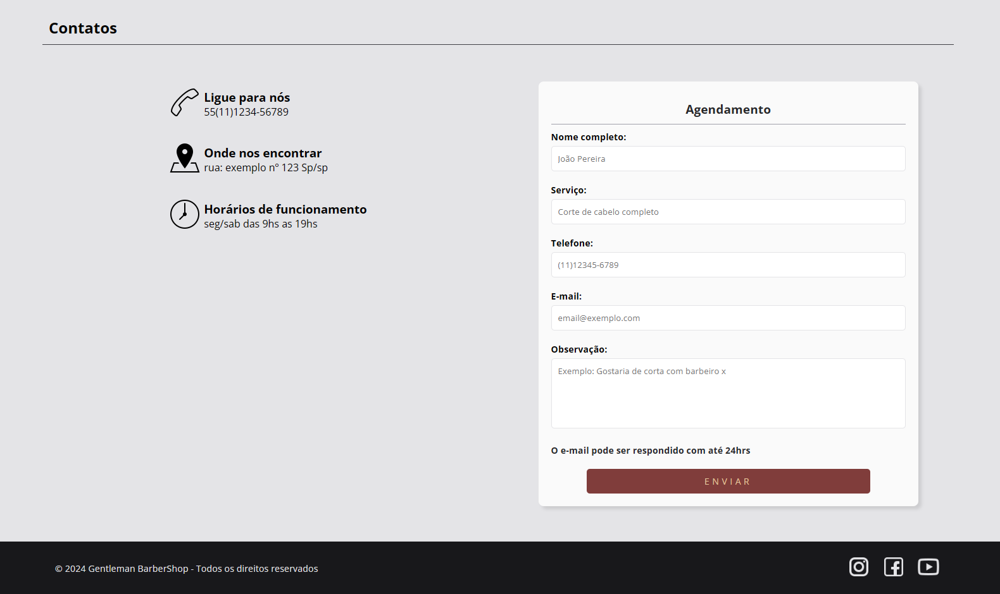

# Gentlemen Barbershop Website

## Visão Geral
Bem-vindo ao projeto do site front-end da **Gentlemen Barbershop**, uma barbearia tradicional localizada no coração de São Paulo. Fundada em 2024, nossa barbearia combina serviços de alta qualidade com um ambiente acolhedor, valorizando o bem-estar e a conversa entre os clientes.

## Funcionalidades Principais
### Home
A página inicial captura a essência da Gentlemen Barbershop, com uma imagem de destaque e uma introdução que apresenta a atmosfera clássica e acolhedora da barbearia.

### Sobre
Nesta seção, contamos a história da Gentlemen Barbershop, destacando nossos valores, a tradição e o compromisso com a excelência nos serviços prestados.

### Serviços
Detalhamos os serviços oferecidos, com descrições claras e concisas:
- **Corte Completo**: Corte de cabelo completo utilizando máquina e tesoura.
- **Corte Máquina**: Corte de cabelo utilizando somente a máquina.
- **Corte Tesoura**: Corte de cabelo utilizando somente a tesoura.
- **Barbear Completo**: Barbear com todos os procedimentos incluídos.
- **Acabamento**: Todo o acabamento do cabelo.
- **Penteado**: Penteado à escolha do cliente com diversos modelos de pomada e laquê.

### Preços
Informações transparentes sobre os preços dos nossos serviços, permitindo que os clientes planejem suas visitas com antecedência.

### Contatos
Uma seção dedicada para que os clientes possam entrar em contato facilmente, seja para agendar um serviço ou para obter mais informações.

### Formulário de Contato
Inclui um formulário de contato funcional e validado com jQuery, garantindo que as mensagens dos clientes sejam recebidas de forma eficaz.

## Estrutura do Código
- **HTML5**: Estrutura semântica e acessível.
- **CSS3**: Estilos responsivos e modernos.
- **JavaScript**: Funcionalidades interativas e dinâmicas.
- **jQuery**: Validação de formulários e animações suaves.

## Destaques Técnicos
### Design Responsivo
O site é completamente responsivo, garantindo uma experiência de usuário consistente em todos os dispositivos, desde desktops até smartphones.

### Menu Hamburguer
Implementação de um menu hamburguer para navegação móvel, que permite uma experiência de usuário intuitiva em dispositivos menores.

### Animações Suaves
Uso de jQuery para animações suaves, incluindo a navegação entre seções da página com rolagem suave.

### Validação de Formulário
Validação de formulário robusta usando jQuery Validation Plugin, garantindo que as entradas do usuário sejam corretas antes do envio.

## Capturas de Tela
### Sobre

### Serviços

### Preços

### Contatos

## Autor
Desenvolvido por Rafael Barbosa, um desenvolvedor apaixonado por criar experiências web intuitivas e envolventes. Sinta-se à vontade para explorar o código e usar este projeto como uma referência para o seu próprio portfólio.
